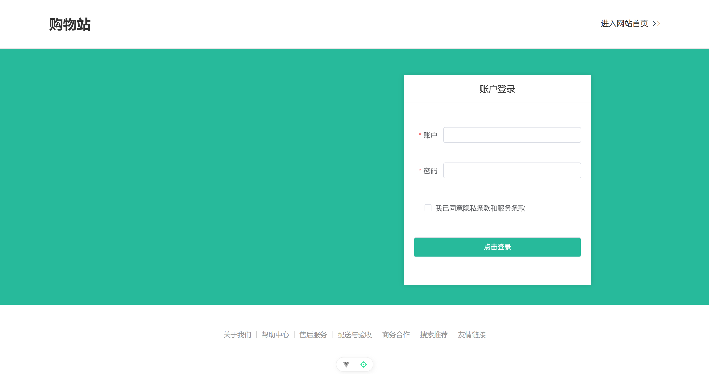
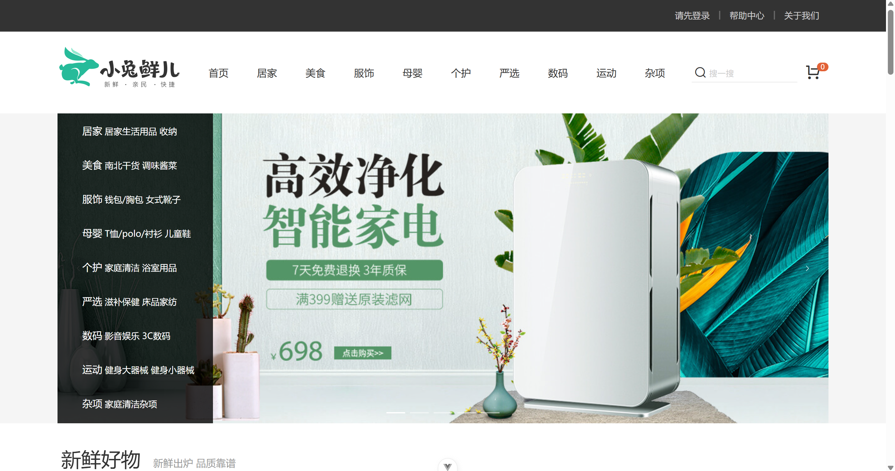
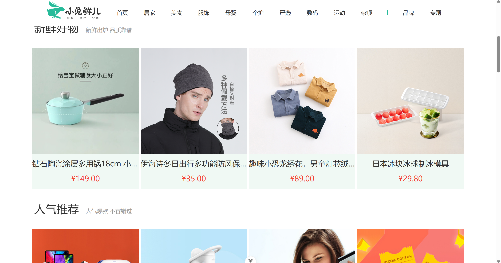
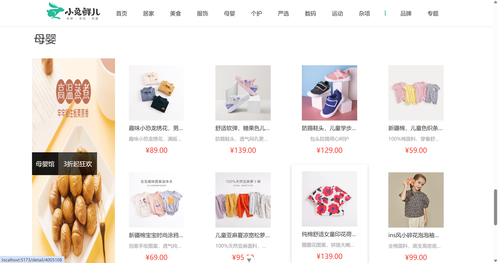
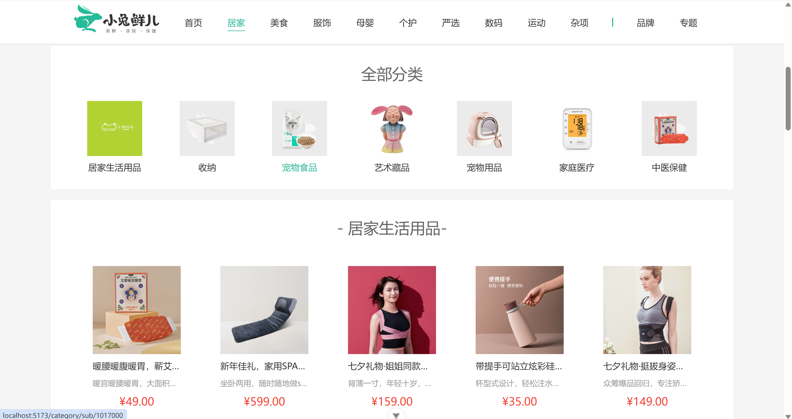
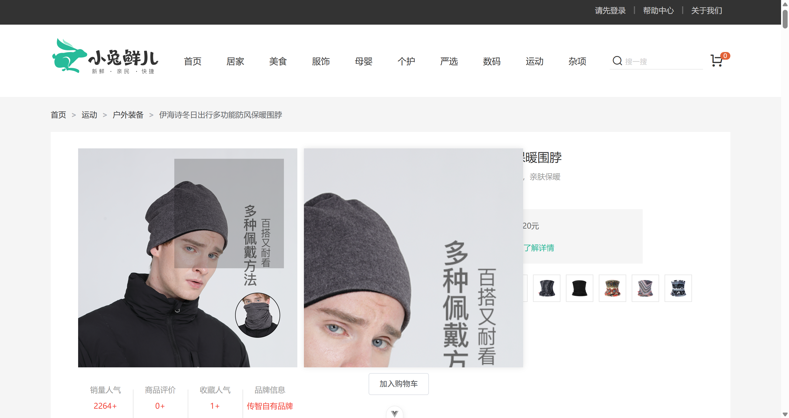
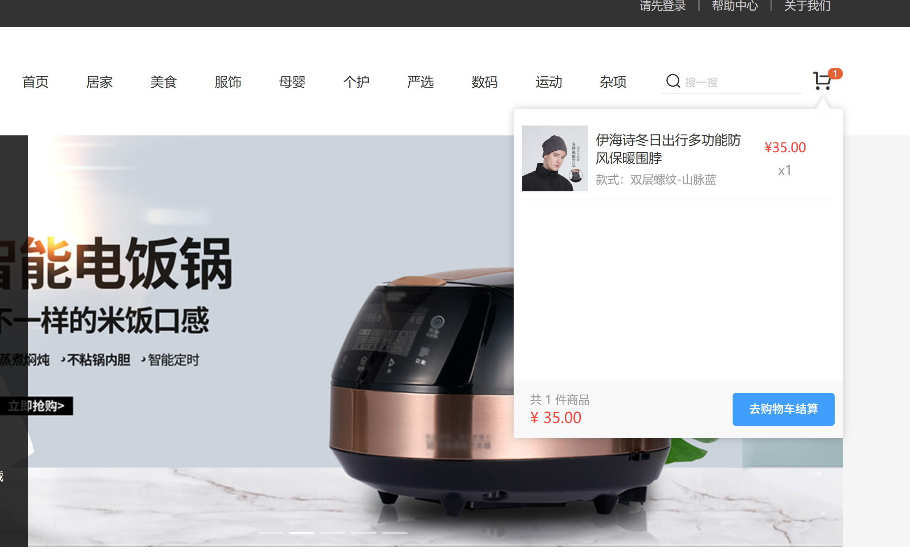
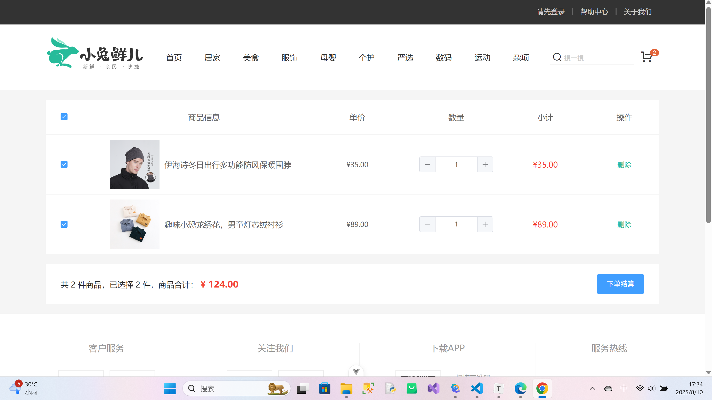
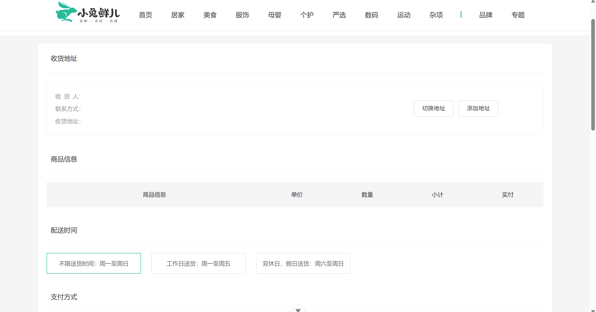

# 🐇 小兔鲜 - Vue3 电商平台

进阶学习Vue3项目，跟随B站视频做的电商项目。

一个基于 Vue3 的现代化生鲜电商平台，实现了完整的电商核心功能流程。

## 页面展示

#### 登录页



#### 首页










#### 商品详情页




#### 购物车



#### 结算页






## 🚀 项目特色

- 采用 Vue3 Composition API + Pinia 状态管理
- 使用 Vue Router 实现动态路由和权限控制
- 基于 VueUse 的组件化和工具库
- 完整的电商功能：商品展示、购物车、订单结算、支付流程等
- PC端
- 采用 Axios 封装的前后端数据交互

## 📦 技术栈

**核心框架**  
- Vue 3.4+  
- Pinia 2.1+  
- Vue Router 4.2+  

**辅助工具**  
- Axios 1.5+  
- VueUse 10.0+  
- ESLint

**构建工具**  
- Vite 5.0+  

## 🛠️ 项目结构

```bash
src/
├── api/               # API请求封装
├── assets/            # 静态资源
├── components/        # 公共组件
├── composables/       # 组合式函数
├── router/            # 路由配置
├── stores/            # Pinia状态管理
├── styles/            # 全局样式
├── utils/             # 工具函数
├── views/             # 页面组件
├── App.vue            # 根组件
└── main.js            # 入口文件
```

## 🌟 核心功能

### 1. 用户系统

- 登录/注册
- 个人中心
- 地址管理

### 2. 商品系统

- 商品分类展示
- 商品搜索与筛选
- 商品详情页（SKU选择）

### 3. 购物流程

- 购物车管理（本地+服务端同步）
- 订单创建与结算
- 模拟支付流程

### 4. 高级特性

- 图片懒加载

## 📚 学习收获

通过本项目实践，深入掌握了：

- Vue3 Composition API 的高级用法
- Pinia 状态管理的最佳实践
- 前端性能优化技巧
- 电商类项目的典型架构设计
- 组件化开发思维

## 难点/亮点

1. 函数封装：数据业务代码封装成一个独立的函数，内部自动在组件挂载时请求数据。实现了业务逻辑与UI组件解耦，提升代码的可维护性和可读性。
2. 图片懒加载指令：在电商项目中，商品详情页有大量的图片加载，会影响首屏的加载速度。自定义了v-img-lazy指令实现图片懒加载。
3. 长页面吸顶：当长页面滚动超过一定阈值时，导航栏会固定在页面顶部。提升用户的体验。
4. Pinia持久化存储token：避免刷新丢失数据。
5. 用户通过顶部导航栏切换商品分类时，页面滚动条会停留在上一次的位置（Vue Router 的默认行为），这样导致新内容从页面中间开始显示，用户需手动滚动到顶部，所以通过Vue Router的scrollBehavior统一重置页面位置。